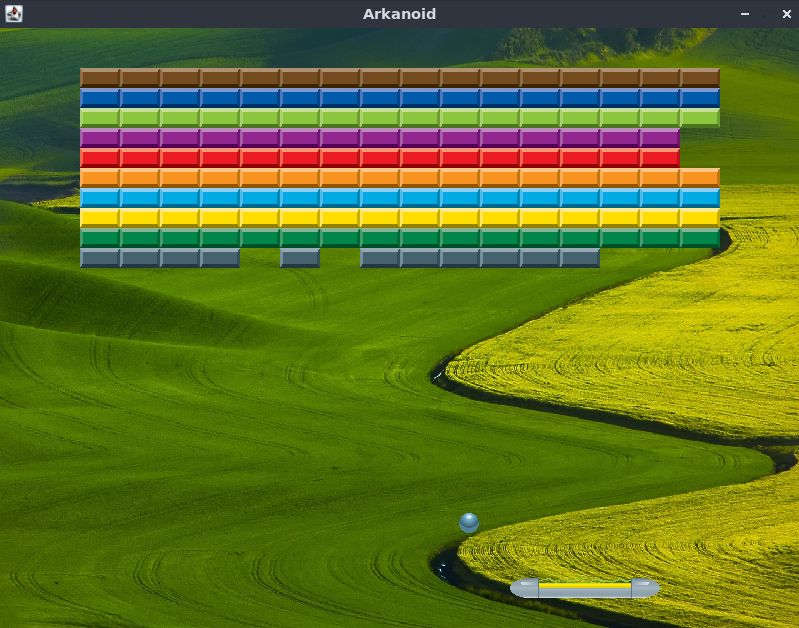

# Welcome to my portfolio

## Introduction

My name is Peter Csaba Szobonya, I am from Hungary, and currently  I am studying Software Development at Eötvös Loránd University.
I am a hard working, honest individual. I am a good timekeeper, always interested in acquiring new skills and I unfailingly make time to become familiar with new concepts. I am friendly, helpful and polite, have a good sense of humor. I am able to work independently in busy environments and also within a team setting. I am an able listener who would not shy away from making suggestions when it feels right.
I love sports especially team sports like basketball and football but I could not say no to a grand bike tour. I am a keen traveler and an eager but super beginner photographer.

---

### Good to know

I divided my portfolio into different sections so it would be easier to navigate but I will summerize the whole thing here. Of course it is possible that as time goes on new projects will pop in here or older ones will be deleted so if there is any difference between this file and the content of the portfolio just dive in and explore the projects. I will try my best to keep this up to date and attach a readme for every section and every project.

---

## Java projects

Here I put projects from My University. There is one console program and the other two projects are games with some simple graphics.
The console project is a simple simulation project that we did at the Uni to revise our Java knowledge.
One of the other two projects is an arkanoid game with several levels. And a more complex game from the film Tron. The second project has an SQL leaderboard and multiple options for the players.

---

## Web development

For web development I have two projects one is focused on javascript and the other is on php.
The javascript project is created after a game called Set and has several features. It has single and multiplayer mode, practice mode with reduced cards and plus help buttons and comptetive mode. The results can be seen on screen as a leaderboard for different game types.

The other project that is focused on php is an appointment creation page for Covid vaccination. Where every user can create an user account and able to apply for vaccination in a calendar. If already applied the user can delete the appointment to change it for another date.

---

## C projects

The problems I solved as C projects were given to me by a good friend who studies at a British university. I loved working on them because it showed me things that I never knew before. It was challenging but exciting at the same time and I gained a lot of experience from it.
As of now there are two projects that I uploaded and was written in C. The first is about multi threading and resource management. Where I had to calculate a circles area inside a unit square by generating random points and deciding if they were inside the circle or not. and the second is about POSIX system calls.

---

## C++ projects

I only put one project here to showcase that I uderstand the Object Orianted C++ codeing. This is one of my homeworks from my first Uiversity year. A simple atmosphere simulation program.
