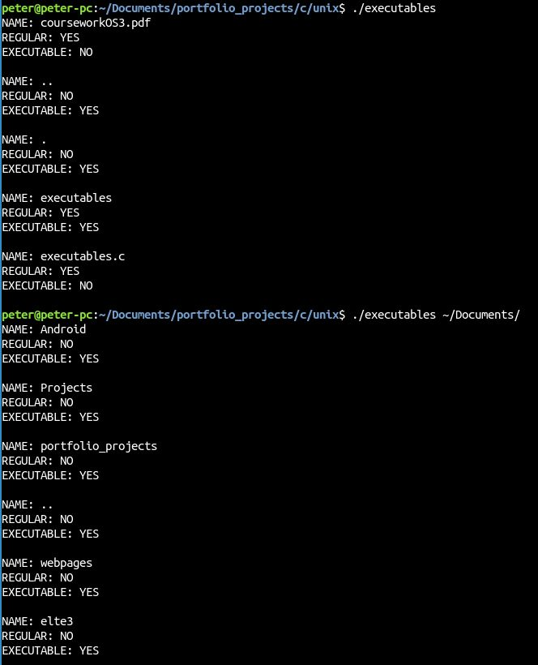

# Welcome to the C language section

To this section I put coursework projects from a Brittish university. One of my friends is attending a Brittish University and she sent me the exercises so I can experience their education a little bit. This way I learned things that we are not taught at the Eötvös Lóránd University. 
For me to work in C was very fun because there are so many small things to watch out and so many things to keep in mind. I very much like the challange to work in it. Almost every time I work with C I learn something new, which is thrilling for me.
There are two projects here as of now. One of them is about multi-threading called Circle. and the other one is about POSIX system calls.

---

## Circle project

This assignment is about estimating the area of a unit circle inside a unit square. The way the area should be approximated is generating random points inside the unit square and check wheather the point is inside the circle or not. After the points are generated and checked the area is calculated by the proportion of points inside of the circle and the ones that are not. There are several stages of the excercise. 

The first stage is a single threaded program thats generates the points and checks if they are inside the circle. This is highly inefficient as we have to generate a lot of points to have the area as close to the real value as possible. 
In the next stage the program became multi-threaded, so it could execute the calculations simultaneously and this way the program executes faster. And can use the computers resources more efficiently. 
The third stage is about avoiding race condition and amploying a mutex to ensure that only one thread can acces the given workspace at the same time.
I created a fourth stage where I put several resources so the user can set the number of resources as well.

The picture below shows the amount of time it takes for the given stages to execute and estimate the area of the circle.

 

---

## Unix project

This assignmentis about using POSIX calls inside a C written program. The program should be able to list all the files that are executable by the user. With this project I gained some experience about system calls within programs.
The program can take one parameter that is the path of a directory that we would like to scan for executables. If the parameter is not given the program will scan the current folder.

