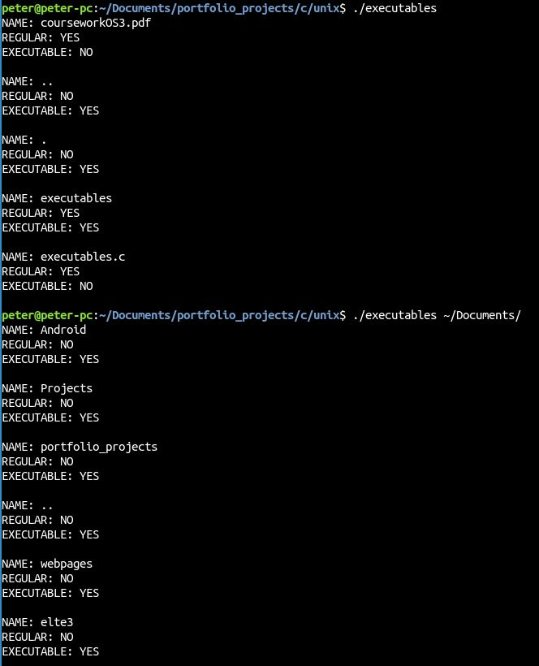

## Unix project

This assignmentis about using POSIX calls inside a C written program. The program should be able to list all the files that are executable by the user. With this project I gained some experience about system calls within programs.
The program can take one parameter that is the path of a directory that we would like to scan for executables. If the parameter is not given the program will scan the current folder.

