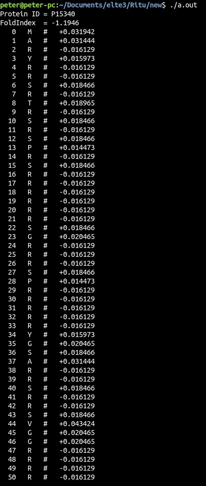

# Welcome to the C++ section

In this section I have projects from my second term from the University. When we started to learn Object Oriented Programming with the language C++. This section so far is mainly here because this way I can prove that I learnt and understand Object Oriented C++. I have an atmosphere simulation here and an exam task.

---

## Atmosphere Simulation

This project simulates the changes of different atmosphere layers for different weather conditions. There are three different kind of layers and three different conditions. The conditions are represented as a string and every character stands for a given days conditions. The program claculates the changes for every day and prints it, so the changes can be followed.
The program also contains unit tests to check for every possible problem. For the tests I used Catch 2 library.

The picture below is showing the output of the simulation.

This picture below shows the results of the unit tests.

---

## Exam task

The exam task is again from a friend of mine. It comes from a Brittish university. The task was to complete, correct and expand the given code. The core of the task was to process Amino acid chains and calculate the proteins fold index value. When the values are calculated and sorted they are written into a new ordered file.
The code had intentional errors so it would feel more like a work project. So I had to spot the errors and correct them while implementing a new feature to the base code.

