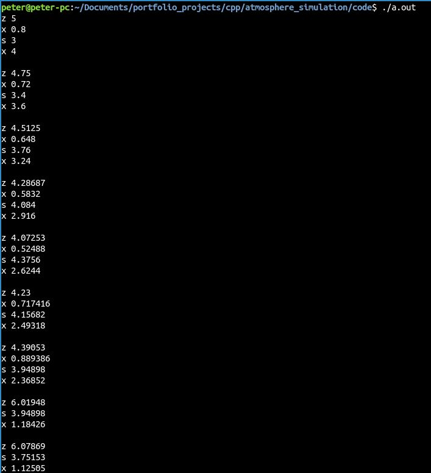
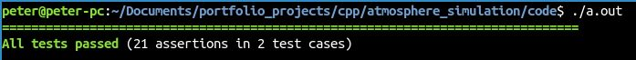

# Atmosphere Simulation

This project simulates the changes of different atmosphere layers for different weather conditions. There are three different kind of layers and three different conditions. The conditions are represented as a string and every character stands for a given days conditions. The program claculates the changes for every day and prints it, so the changes can be followed.
The program also contains unit tests to check for every possible problem. For the tests I used Catch 2 library.

The picture below is showing the output of the simulation.

This picture below shows the results of the unit tests.
