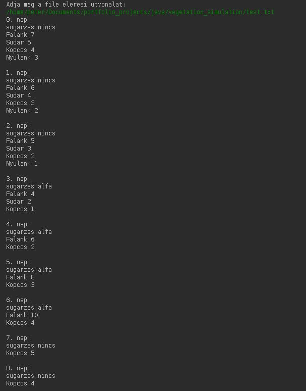
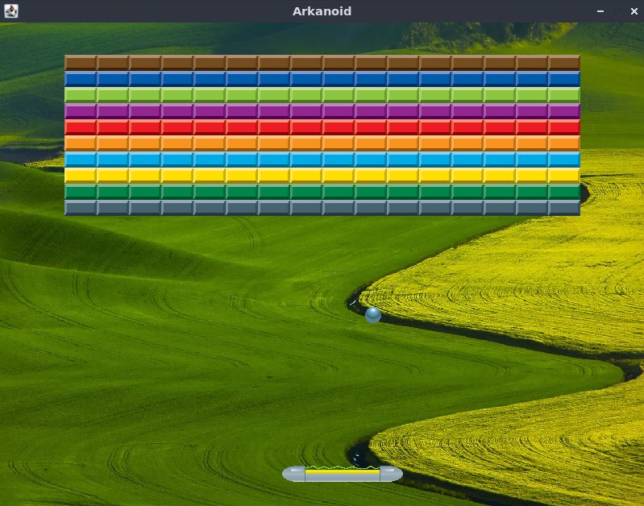
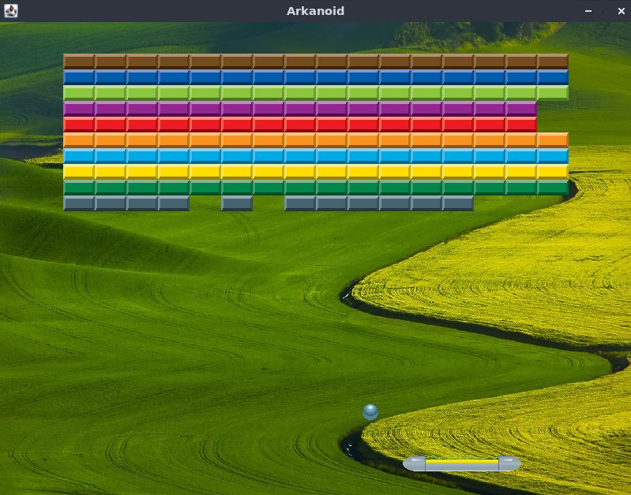
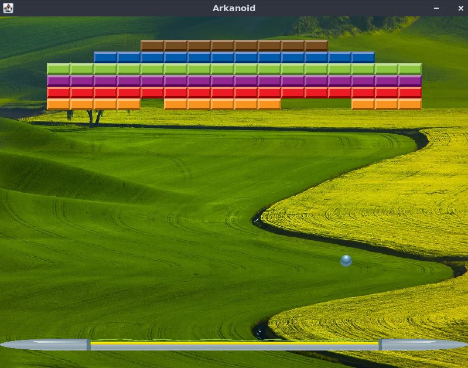
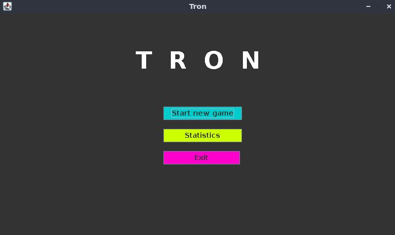
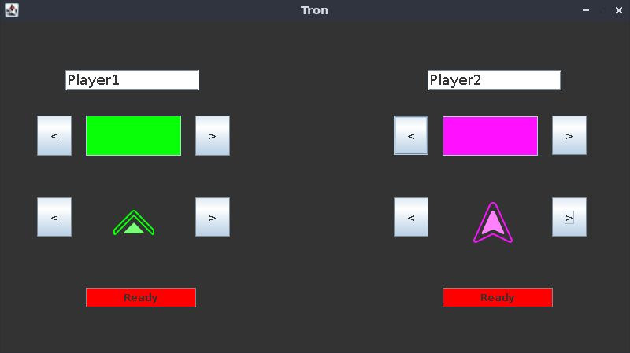
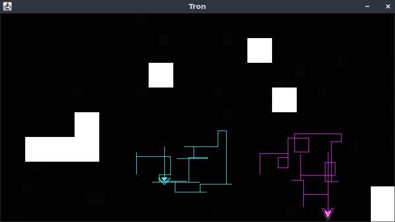
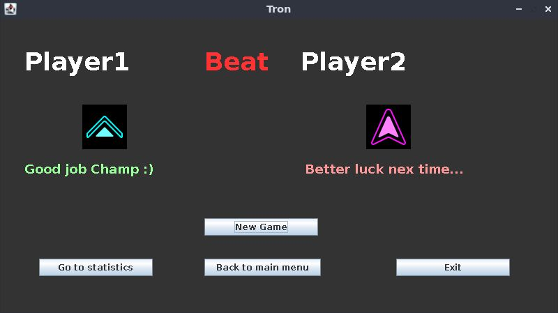
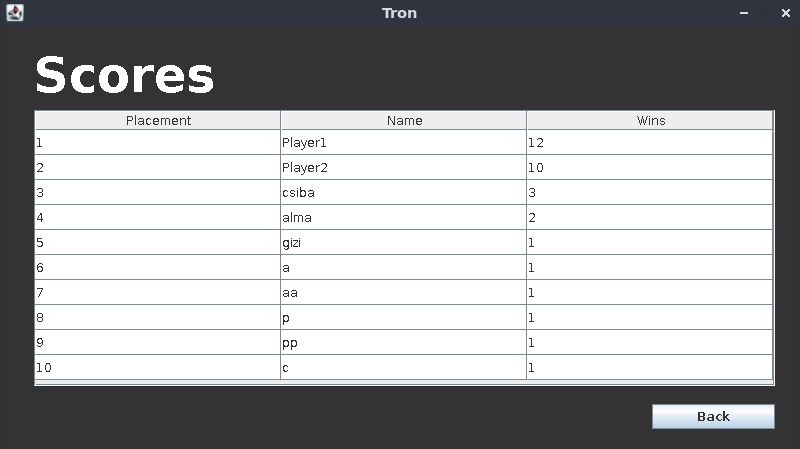

# Welcome to the JAVA section

In this section I have several Java projects. One of the projects is a console application while the other two has graphical interface. The console app is a vegetation simulation while the two others are simple games.

---

## Vegetation Simulation

This simple project was a school assignment. Where I had to create a simulation of plants life. The simulation generates the soil differences according to different given radiations. 
The project builds from an original parent class and every plant is child of that class.

---

## Arkanoid Game

This game was one of our tasks at university. This was the first simple game we did and I liked it very much. This game is about moving a paddle at the bottom of the screen and bouncing a ball with it to destroy the given blocks.

Picture of the start of the game.

Picture of the game with several destroyed bricks.

Picture of the second stage.

---

## Tron Game

This project was my last assignment at the end of my third university term. The game has a menu for easy navigation. The game is inspired by the movie Tron. It is the bike race in a 2d game. The bikes are represented as arrows which can be selected by the players as well as the arrows colors. 
The game area is generated randomly and in the process the pattern is checked so the two players can always meet.
The games aim is to get the other player crash into your trail so his bike would break. When this happens the game ends and a victory screen appears.
The game has a statistical section where the best players records are kept.

This picture shows the menu of the game.

This picture shows the player selection for the game.

This picture shows the game screen.

This picture shows the end game screen.

This picture shows the statistics of the winners.
