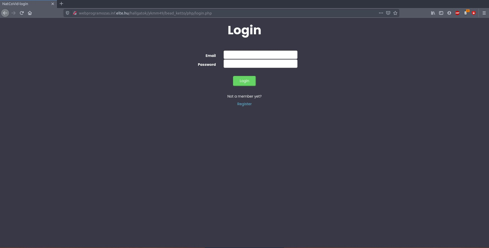

# Welcome to the Web-dev section

In this section I have a dedicated Javascript and a dedicated PHP project. These projects were school assignments where I got familiar with both of the languages. The Javascript app is a game that was created after a boardgame called Set. The games aim is to find within the given cards. If you find one the selected cards disappear and new ones appear. The PHP program is a vaccination appointment creator where the users can create their account and register for vaccination.

---

## Set Game

This game is created after a cardgame called Set. The game is about finding patterns within the given cards. The program shuffles the given deck and and puts the needed cards on the table. Tha player or players select the tripplets until the deck ends. If the game is over the players scores are kept in a leaderboard. The cards are stored as svg files.
The program has advanced settings so the player can add buttons that can help in practice. 
If there is one player there is a timer so the player would know how good the score was. If there are more than one player every player has to select so the game would know who is scoring the point.

Picture of the homescreen.

Picture of the game.

Picture of the endgame page and scoreboard.

---

## Covid Appointment maker

This project is created as a assignment for my university. The aim of the website is so users can create appointments for vaccination.
Every user can register their own user profile and every time they visit the page they can log in and use their existing profile. When they are logged in they will see a calendar with green and red colors. The red color means that there is at least one open assignment that they. If the color is red of course that means that all the assignments are taken. If the calendar date has no color that means that there are no assignments that day.
There is an admin user who can create the assignments.
Every user can apply for appointments if they dont have one already. However if they already have an assignment they can cancel it and reapply for a new one.

Picture of the welcoming page of the website.

Picture of the login and register screens.

Picture of the interface when someone is logged in.

Picture of the application screen.
