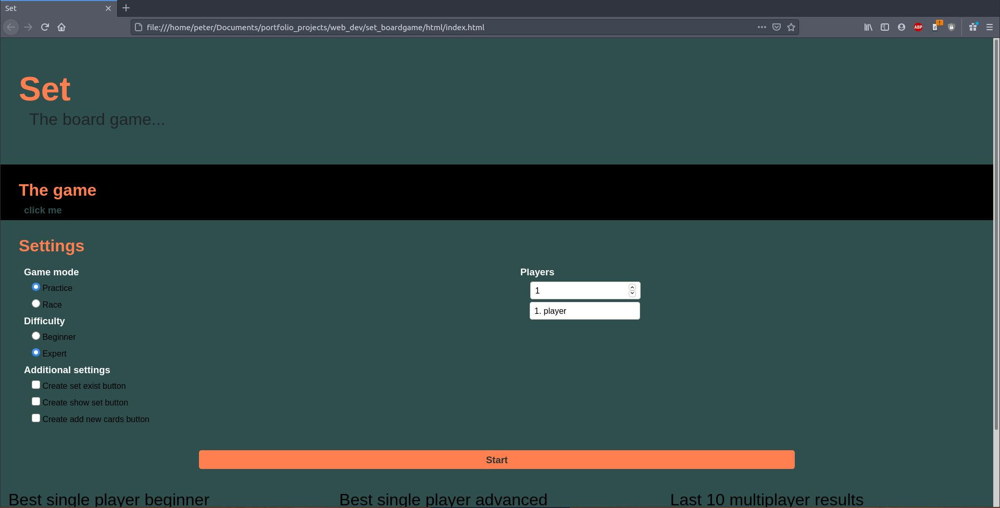

# Set Game

This game is created after a cardgame called Set. The game is about finding patterns within the given cards. The program shuffles the given deck and and puts the needed cards on the table. Tha player or players select the tripplets until the deck ends. If the game is over the players scores are kept in a leaderboard. The cards are stored as svg files.
The program has advanced settings so the player can add buttons that can help in practice. 
If there is one player there is a timer so the player would know how good the score was. If there are more than one player every player has to select so the game would know who is scoring the point.

Picture of the homescreen.

Picture of the game.

Picture of the endgame page and scoreboard.
