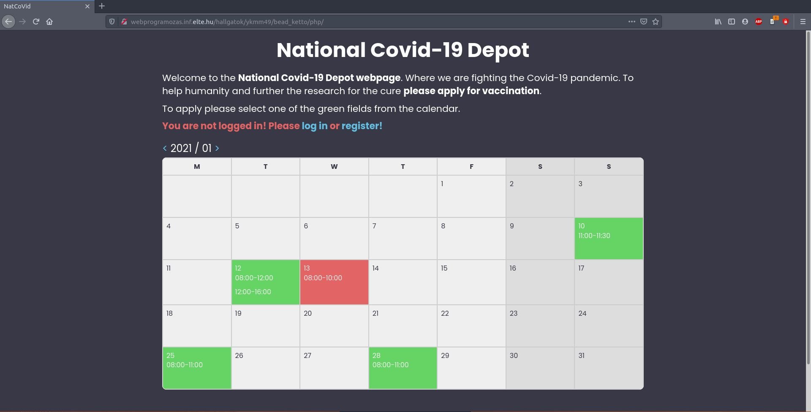
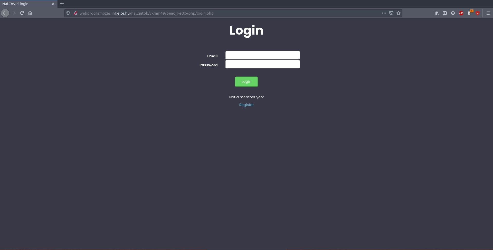
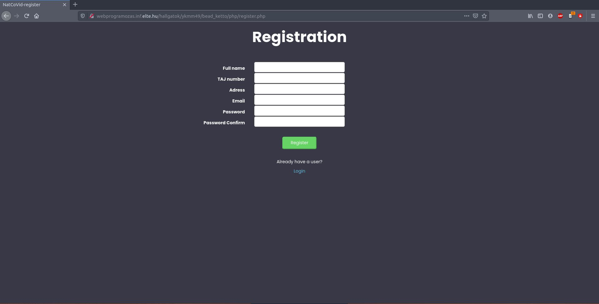
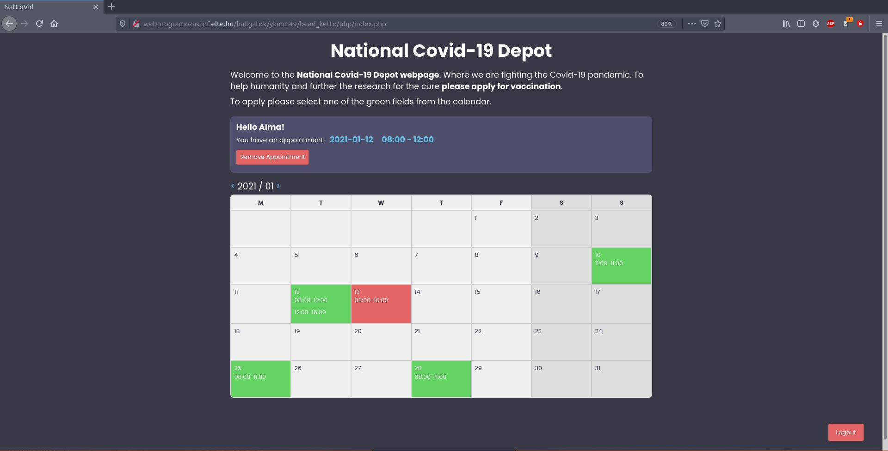
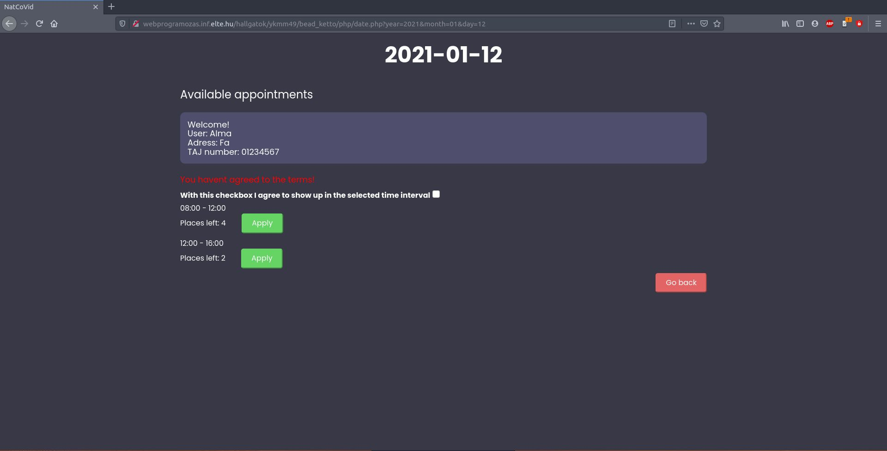

# Covid Appointment maker

This project is created as a assignment for my university. The aim of the website is so users can create appointments for vaccination.
Every user can register their own user profile and every time they visit the page they can log in and use their existing profile. When they are logged in they will see a calendar with green and red colors. The red color means that there is at least one open assignment that they. If the color is red of course that means that all the assignments are taken. If the calendar date has no color that means that there are no assignments that day.
There is an admin user who can create the assignments.
Every user can apply for appointments if they dont have one already. However if they already have an assignment they can cancel it and reapply for a new one.

Picture of the welcoming page of the website.

Picture of the login and register screens.

Picture of the interface when someone is logged in.

Picture of the application screen.
